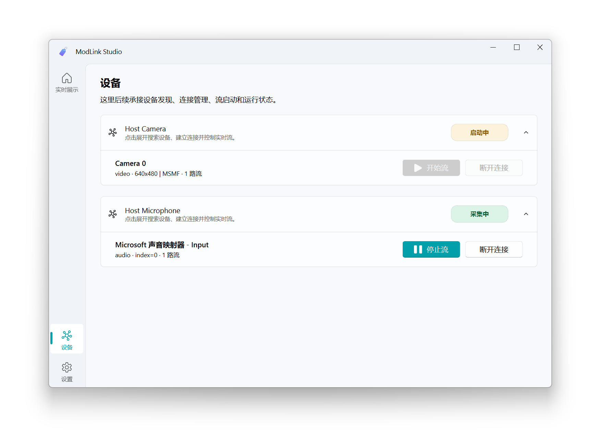
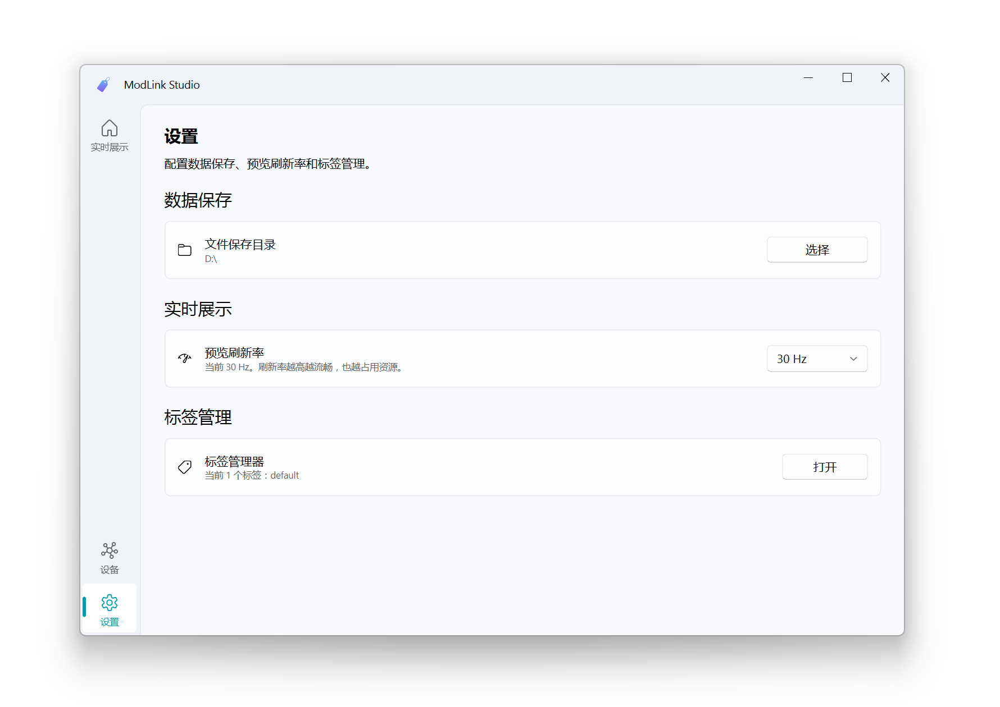

# ModLink Studio

面向设备接入、多模态采集与展示的桌面宿主项目。

ModLink Studio 的目标不是为每一种设备单独写一个上位机，而是把设备搜索、连接、流描述、实时预览、采集控制和录制保存统一到同一套运行时里。设备接入者主要实现 driver 和 `StreamDescriptor`；宿主、录制链路和大部分展示逻辑复用平台层能力。

当前仓库主线是 `0.3.0rc1`，对应 `0.3.0` 的当前 WIP / RC 阶段：

- `modlink_sdk` / `modlink_core` 已切成纯 Python runtime
- `0.2.0` 不兼容 `0.1.x` 的 Qt-style driver API
- UI 仍处于适配期，但 backend 已经从 Qt 运行时语义中拆开
- `0.2.0` 的发布边界是稳定采集、录制和保存；录制回放延后到 `0.3.0`

当前版本变更摘要见根目录 [CHANGELOG.md](CHANGELOG.md)，后续版本规划见 [ROADMAP.md](ROADMAP.md)。


<details>
  <summary>查看更多界面截图</summary>

  <p>
    
  </p>
  <p>
    
  </p>
</details>

## Release Status

`0.3.0rc1` 当前处于预发布阶段：

- 正式公开发布渠道：**PyPI**
- `TestPyPI rehearsal` 已完成
- `TestPyPI` 只用于发布链路演练，不作为日常安装源
- 当前仓库已切到 `0.2.0` 正式版代码

## Install

`0.2.0` 的主安装入口是：

```bash
python -m pip install modlink-studio
```

当前安装完成后可用的宿主入口有：

```bash
modlink-studio
```

安装插件不再通过 PyPI extras。主包安装完成后，可使用独立的插件管理命令按需安装插件。

当前第一阶段，这个命令先覆盖官方驱动插件；后续会逐步扩成更通用的插件管理入口，而不仅仅是官方驱动安装器：

```bash
modlink-plugin list
```

```bash
modlink-plugin install host-camera
```

```bash
modlink-plugin list --installed
```

```bash
modlink-plugin status
```

```bash
modlink-plugin uninstall host-camera
```

更完整的安装说明、升级说明和源码运行方式见 [vpdocs/install.md](vpdocs/install.md)。

## Plugin Management

`0.2.0` 当前提供以下官方驱动：

- Host Camera
- Host Microphone
- OpenBCI Ganglion

这些驱动现在由独立仓库 [`ModLink-Studio-Plugins`](https://github.com/modlink-studio/ModLink-Studio-Plugins) 维护；安装路径是：

- 先安装 `modlink-studio`
- 再使用 `modlink-plugin install <plugin_id>` 从插件仓库 Pages 索引解析版本，并从插件仓库 GitHub Release 安装对应插件 wheel

当前这个命令仍以官方驱动为中心；后续版本会把它继续扩展成更完整的插件管理工具，例如统一查看插件状态、已安装第三方插件、安装来源和可升级项。

## Driver Development

`0.2.0` 这一版的公开发布重点是主宿主包 `modlink-studio`，不会同步公开独立的 `modlink-sdk` PyPI 包。

不过仓库里的 SDK 契约和 driver 接入模型已经稳定下来；如果当前要做内部联调或前置驱动开发，仍然建议按这条边界思考：

- `modlink-sdk`
- 设备自身的传输层依赖

只有在确实需要运行时服务时，才额外依赖 `modlink-core`。当前 `0.2.0` 阶段如果要做外部 driver 联调，应以源码仓库和本地环境为准，而不是假定存在独立公开的 SDK 安装包。

如果是新建 driver 项目，可以使用独立脚手架工具：

```bash
npx @modlink-studio/plugin-scaffold --zh
```

如果希望由 AI 从设备描述生成可运行插件，可以使用独立的 Python agent。它内置确定性的 Python scaffold writer，不依赖 npm / npx；随后会让 OpenAI-compatible 模型补完 driver 代码、README 和测试，并在生成项目内创建 `.venv` 做验证和修复：

```bash
$env:MODLINK_AI_BASE_URL = "https://api.example.com/v1"
$env:MODLINK_AI_MODEL = "gpt-compatible-model"
$env:MODLINK_AI_API_KEY = "..."
uv run modlink-plugin-agent generate "生成一个串口双通道压力传感器插件" --out ./plugins
```

在仓库内联调脚手架时：

```bash
npm install
npm --workspace @modlink-studio/plugin-scaffold run dev -- --zh
```

这个工具会交互式生成一个可启动的 driver 项目骨架，通常包括：

- `pyproject.toml`
- `README.md`
- `LICENSE`
- `.gitignore`
- `<plugin_name>/driver.py`
- `<plugin_name>/factory.py`
- `<plugin_name>/__init__.py`
- `tests/test_smoke.py`

## Repository Layout

```text
modlink-studio/
├─ apps/
│  ├─ modlink_studio/
│  └─ modlink_server/
├─ packages/
│  ├─ modlink_sdk/
│  ├─ modlink_core/
│  └─ modlink_ui/
├─ tools/
│  ├─ modlink_plugin_scaffold/
│  └─ modlink_plugin_agent/
└─ vpdocs/
```

- `apps/modlink_studio/`: 主桌面宿主入口
- `apps/modlink_studio/modlink_studio/plugin/`: 跟随主宿主一起发布的插件管理 CLI
- `apps/modlink_server/`: FastAPI 服务宿主入口
- `packages/modlink_sdk/`: 当前仓库内的最小 SDK 契约
- `packages/modlink_core/`: 纯 Python runtime、流总线和采集基础设施
- `packages/modlink_ui/`: 当前唯一的 Qt Widgets UI 包，内部同时承载 Qt bridge
- `tools/modlink_plugin_scaffold/`: 独立 npm driver 脚手架工具
- `tools/modlink_plugin_agent/`: 独立 Python AI driver 生成 agent
- `vpdocs/`: VitePress 文档站源码

## Contributor Setup

仓库内开发使用 `uv`：

```bash
uv sync
uv run modlink-studio
```

如果要带控制台和更高日志级别启动桌面宿主：

```bash
uv run modlink-studio-debug
```

如果要联调官方驱动源码，请切到独立仓库 `ModLink-Studio-Plugins` 进行构建与发布验证；主仓库不再承载官方驱动源码目录。

根仓库执行 `uv sync --dev` 后，`apps/modlink_server/tests` 也会被当前工作区虚拟环境直接覆盖；不需要再单独创建 server 专用环境。

### Code Style And Pre-Commit

当前仓库把 Python 和 `tools/modlink_plugin_scaffold` 的 TypeScript 工具链分开治理：

- Python 代码统一使用 `ruff` 负责 lint、import sorting 和 format，配置位于根 [pyproject.toml](pyproject.toml)
- 提交前检查使用根 [`.pre-commit-config.yaml`](.pre-commit-config.yaml)
- 编辑器基础约束写在根 [`.editorconfig`](.editorconfig)
- Git 行尾策略写在根 [`.gitattributes`](.gitattributes)
- `tools/modlink_plugin_scaffold/` 这条 React + Ink + TypeScript 工具链使用 `Biome`

首次使用建议安装 pre-commit：

```bash
uv run pre-commit install
```

手动运行整套提交前检查：

```bash
uv run pre-commit run --all-files
```

只跑 Python 这一层的检查与格式化：

```bash
uv run ruff check . --fix
uv run ruff format .
```

只跑 `plugin_scaffold` 这条 TypeScript 工具链：

```bash
npm run scaffold:lint
npm run scaffold:lint:fix
npm run scaffold:format
```

## Docs And License

项目文档使用 VitePress，源码位于 `vpdocs/`，站点发布到 `https://modlink-studio.github.io`。

本地预览：

```bash
npm ci
npm run docs:vp:dev
```

构建文档：

```bash
npm ci
npm run docs:pdoc:build
npm run docs:vp:build
```

当前仓库整体按 `GPL-3.0-or-later` 路线发布，详细条款见根目录 [LICENSE](LICENSE)。
